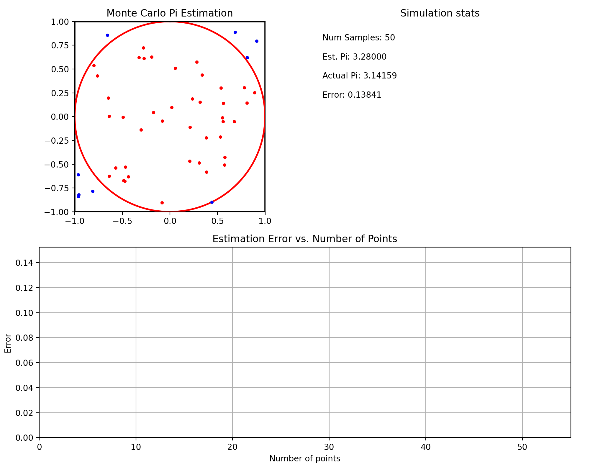

# Monte Carlo $\pi$ Estimator & Visualizer

This Python project demonstrates the estimation of Pi ($\pi$) using the Monte Carlo method. It features an animated multi-panel display showing:
1.  A scatter plot of randomly generated points within a square and a circle.
2.  A dynamic graph plotting the estimation error against the number of simulated points.
3.  A text panel displaying live statistics like the current Pi estimate, total points, and error.

## Features

*   **Monte Carlo Simulation:** Core logic for estimating Pi using random sampling.
*   **Multi-Panel Animation:** Uses Matplotlib's `FuncAnimation` to provide a dynamic visualization of the simulation process.
    *   **Scatter Plot:** Visually shows points classified as inside or outside the unit circle within a 2x2 square.
    *   **Error Plot:** Tracks the convergence of the estimated Pi towards the actual value by plotting the absolute error.
    *   **Statistics Panel:** Displays real-time updates of `Total Samples`, `Estimated Pi`, `Actual Pi`, and `Current Error`.
*   **Clear Visualization:** Helps in understanding the principles of the Monte Carlo method and the Law of Large Numbers.

## How it Works

The simulation generates random points (x, y) within a square (e.g., from -1 to 1 on both axes). A circle of radius 1 is inscribed within this square. The ratio of points falling inside the circle to the total points generated is used to estimate π based on the area formulas:

$\pi \approx 4 \cdot \frac{(\text{Points inside the circle})}{\text{Total Points Thrown}}$

The animation visualizes this process, updating the estimate and plots as more points are added.

## Requirements

*   Python 3.x
*   Matplotlib
*   NumPy

## Setup and Usage

1.  **Clone the repository (if you're getting it from GitHub):**
    ```bash
    git clone https://github.com/Zibhelina/monte-carlo-pi-visualizer
    cd monte-carlo-pi-visualizer
    ```

2.  **Create and activate a virtual environment (recommended):**
    ```bash
    python -m venv venv
    # On Windows
    # Make sure you are in the project root directory in your terminal
    .\venv\Scripts\activate
    # On macOS/Linux
    # Make sure you are in the project root directory in your terminal
    source venv/bin/activate
    ```

3.  **Install dependencies using `requirements.txt`:**

    ```bash
    pip install -r requirements.txt
    ```

4.  **Run the script:**

    ```bash
    python monte_carlo_simulation.py 
    ```

## Screenshots / Animation

Here's an example of the visualization in action:

